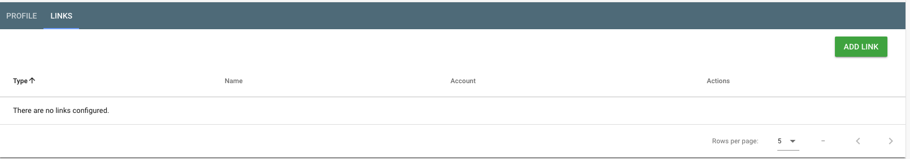
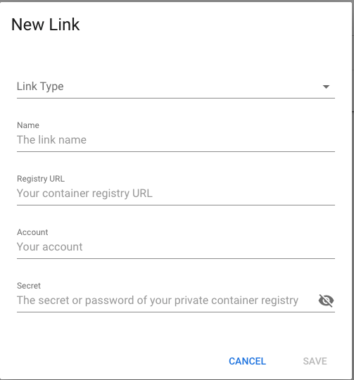
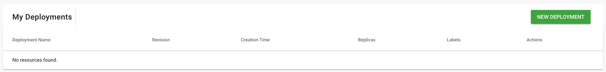
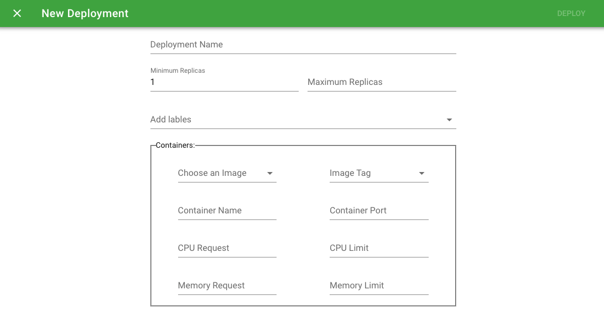
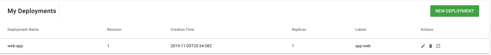

# Guideline of the PiNative Alpha Version 

### 1. Link your container registry
1. Go to **Settings** from left menu, and click the <strong>LINKS</strong> tab

2. Create a new LINK by click the **ADD LINK** button

>**Link Type** - Choose the Docker Hub. 
>**Name** - Give a name for this link. 
>**Registry URL** - The container registry URL e.g.https://registry.pinative.io/v2/, by default it's the docker hub. 
>**Account** - Your container registry account name. 
>**Secret** - Your container registry password, **ONLY** setup this if you would like deploy private images.

### 2. Deploy your APPLICATION 
**NOTE** You have to make sure that the container registry was configed succeeded.

1. Go to **Deployments** from left menu

2. Deploy a new app by click the **NEW DEPLOYMENT** button

>**Deployment Name** - Give a unique name for this deployment, e.g. web-app 
>**Minimum Replicas** - The minimum number of podlets you would like to create. 
>**Maximum Replicas** - The maximum number of podlets you would like to create 
>**Lables** - The labels of your current deployment, e.g. app:web, maximum 5 lables you can have. 
>**Image** - Choose an Image you want to deploy. 
>**Image Tag** - Choose a Tag/Version of the image you've chosen. 
>**Container Name** - Give the container a name. 
>**Container Port** - The Container Port to be used, your EXPOSED APPLICATION PORT. 
>**CPU Request** - The minimum CPU this deployment to be used. 
>**CPU Limit** - The maximum CPU this deployment to be used. 
>**Memory Request** - The minimum Memory this deployment to be used. 
>**Memory Limit** - The maximum Memory this deployment to be used. 

3. Act on your deployed apps

Once you deployed an app succeeded, you can get it from the **Deployments**

The Actions you could do
>Modify the deployment by click . 
>Delete the deployment by click . 
>Access the application by click . 
